# Config

## Hotkeys

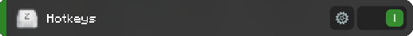

Hier können die Hotkeys eingestellt werden, die bestimmte Funktionen des UnicacityAddons ausführend.

- **Report annehmen** - nimmt einen offenen Report an und schickt die eingestellte Begrüßung
- **Report ablehnen** - schickt die eingestellte Verabschiedung und beendet einen angenommenen Report
- **Öffentlich-Channel betreten** - verschiebt den Nutzer in den öffentlichen Channel seiner Fraktion
- **ABuy und AEquip ausführen** - startet die ABuy oder AEquip Ausführung
- **Screenshot mit Upload zu Imgur** - erstellt einen Screenshot, lädt diesen auf Imgur hoch und kopiert den Link in die
  Zwischenablage

## NameTags

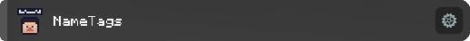

Hier können NameTag-Farben und zusätzliche Informationen aktiviert werden.

- **Fraktionsinfo** - fügt hinter dem Spielernamen das Symbol der Fraktion hinzu
- **Fraktion** - färbt die Namen von Fraktionsmitgliedern in der angegebenen Farbe ein
- **Bündnis** - färbt die Namen von Bündnis-Fraktionen in der angegebenen Farbe ein (es können maximal 2 Faktionen
  angegeben werden)
- **Streetwar** - färbt die Namen von Streetwar-Fraktionen in der angegebenen Farbe ein (es können maximal 2 Fraktionen
  angegeben werden)
- **Hausverbot** - zeigt an, ob ein Spieler Hausverbot im Krankenhaus besitzt (wird nur gezeigt, wenn der Spieler in der
  Nähe des Krankenhauses oder der Feuerwache ist)
- **im Dienst** - zeigt einen grünen Punkt an, wenn sich der Spieler im Dienst befindet (betrifft nur FBI, Polizei,
  Rettungsdienst und News)
- **Blacklist/Contract/WPs anzeigen** - färbt die Namen von Spieler ein, die Blacklist, Contract oder WPs haben (für
  Blacklist und Contract und kann die Farbe festgelegt werden)
- **Farbige Leichennamen** - färbt die Namen von Leichen gleich zur Farbe des Namens des Spielers ein
- **AFK und ADMIN-DIENST Info** - zeigt an, ob sich ein Spieler im AFK oder Admin-Dienst befindet
- **Addon Team Tag** - zeigt an, welchen Rang der Spieler im UnicacityAddon Team besitzt
- **Roleplay Name** - zeigt den eigenen Roleplay Namen an, damit andere Spieler nicht den Minecraft Namen im Roleplay
  nutzen müssen

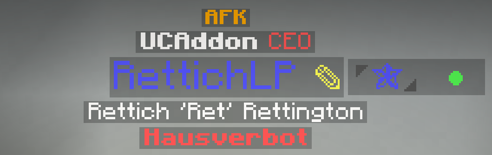

## Reinforcement

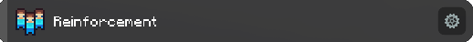

Hier kann der Syntax für die Reinforcement Nachricht und die automatische Screenshot-Einstellung festgelegt werden.

**Parameter für Reinforcement:**

- `%type%` ➜ Reinforcement Typ (z. B. "Reinforcement!" oder "Plant!")
- `%sender%` ➜ Sender des Reinforcement (z. B. "Notarzt RettichLP")
- `%navipoint%` ➜ Navipunkt des Zielortes (z. B. "Stadthalle")
- `%distance%` ➜ Entfernung zum Zielort (z. B. "120")

**Parameter für Reinforcement-Antwort:**

- `%sender%` ➜ Sender der Antwort (z. B. "Notarzt RettichLP")
- `%target%` ➜ Sender des angenommenen Reinforcements (z. B. "Dimiikou")
- `%distance%` ➜ Entfernung zum Zielort (z. B. "120")

**Syntax**

- Reinforcement (Bild): 
 `&c&l%type% &b%sender% &7- &b%navipoint% &7- &3%distance%m`
- UCUtils Reinforcement: 
 `&c%type% &2%sender% &abenötigt Unterstützung in der Nähe von %navipoint%! (%distance% Meter entfernt)`
- UCUtils Reinforcement-Antwort: 
 `&2%sender% &akommt zum Verstärkungsruf von %target%! (%distance% Meter entfernt)`

!!! info

    Für Farbcodes musst du `&` statt `§` verwenden. Wenn du das Feld leer lässt, wird automatisch die Standard Nachricht genutzt.

## Sloc

Hier kann der Syntax für die Sloc Nachricht festgelegt werden.

**Parameter für Sloc:**

- `%sender%` ➜ Sender des Slocs (z. B. "Notarzt RettichLP")
- `%navipoint%` ➜ Navipunkt des Zielortes (z. B. "Stadthalle")
- `%distance%` ➜ Entfernung zum Zielort (z. B. "120")

**Syntax**

- Sloc:  `&c&lPosition! &7- &b%sender% &7- &b%navipoint% &7(&b%distance%m&7)`

!!! info

    Für Farbcodes musst du `&` statt `§` verwenden. Wenn du das Feld leer lässt, wird automatisch die Standard Nachricht genutzt.

## Equip

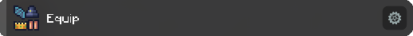

Hier können die Equip Preise eingestellt werden für das Equiplist Feature. Das Feature ermöglicht das Tracken der
equippten Gegenstände und der dadurch entstandenen Preise.

## Drogen

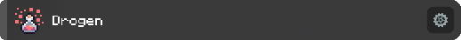

Hier können die Mengen für Eigenbedarf und Preise für den automatischen Drogenverkauf eingestellt werden.

## Nachrichten

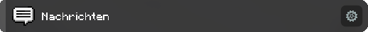

Hier können die Formatierung und der Inhalt verschiedener Nachrichten verwaltet werden.

- **HQ Nachrichten** - ändert HQ Nachrichten für FBI und Polizei zu einem übersichtlicheren Aussehen
- **Service Nachrichten** - ändert Notruf Nachrichten für den Rettungsdienst zu einem übersichtlicheren Aussehen
- **D-Bank Nachrichten** - ändert Drogen-Bank Nachrichten für Bad-Fraktionen zu einem übersichtlicheren Aussehen
- **Contract Nachrichten** - ändert Contract Nachrichten für Hitman zu einem übersichtlicheren Aussehen
- **Gefilterte Contractliste** - zeigt nur noch Spieler in der Contractliste an, die auch online sind
- **Report Begrüßung** - Nachricht, die gesendet werden soll, wenn ein Report angenommen wurde
- **Report Verabschiedung** - Nachricht, die gesendet werden soll, wenn ein Report beendet wird
- **Report Prefix** - fügt die angegebene Nachricht in jede Report-Chat-Nachricht (am Anfang) ein um eine Filterung für
  ein zweites Chatfenster zu ermöglichen.

!!! info

    Für Farbcodes musst du `&` statt `§` verwenden.

## Passwort

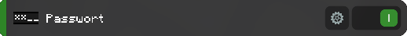

Wenn der Account mit einem passwort geschützt ist, kann das Passwort im Addon hinterlegt werden und wird nach
Serverbeitritt automatisch eingegeben. Das Passwort wird im Klartext (unverschlüsselt) in der
LabyMod-Addon-Configuration gespeichert.

## Start-Befehle

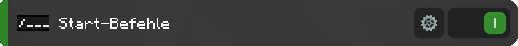

Legt die Befehle fest, die nach Serverbeitritt (und nach Eingabe des Passworts, sofern aktiviert) ausgeführt werden
sollen. Befehle müssen mit `/` eingegeben werden (z. B. `/afk`). Zwischen den Befehlen ist ein Cooldown von 100ms. Da
das kleiner ist als der Cooldown von Unicacity würde das Einfügen von mehreren gleichen Commands zu einem Spam-Kick
führen.

## Texturen Paket Nachricht deaktivieren

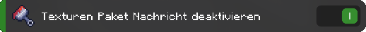

Versteckt die Erinnerung, dass Unicacity ein eigenes Texturen-Paket besitzt.

## Hit Sounds aktivieren

Wenn diese Einstellung aktiv ist, werden beim Serverbeitritt die Hit-Sound-Einstellungen aktiviert. Unicacity hat den
Bug, dass die Sounds bei manchen Spieler deaktiviert, sobald diese den Server verlassen. Durch dieses Feature werden
diese aktiviert nach Serverbeitritt.

## ATM Einstellungen

Hier können verschiedene Bank-Konten ausgewählt werden, die beim Klicken auf einen ATM angezeigt werden sollen.

## Bomben Screenshot

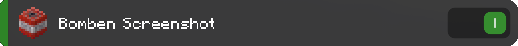

Erstellt automatisch einen Screenshot, wenn ein Bomben-Event abgeschlossen ist. Es spielt keine Rolle, ob die Bombe
entschärft wurde oder nicht.

## Automatisch die Route zum Auto anzeigen

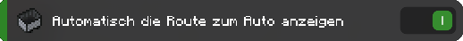

Generiert eine Route zum Auto, dessen Position über `/car find` abgefragt wurde.

## TeamSpeak

Hier können die TeamSpeak Einstellungen verwaltet werden. Die Eingabe eines TeamSpeak API Keys ist nicht notwendig. Hier
können auch die Benachrichtigungen verwaltet werden, wenn ein Spieler einen bestimmten TeamSpeak Channel betritt.

## Tabliste

Hier kann eingestellt werden, ob die Tabliste sortiert werden soll und ob das AFK-Badge hinter dem Namen angezeigt
werden soll (bei Spielern die AFK sind).

## Despawn Zeitpunkt

Zeigt hinter der Karma Nachricht (nach einem Kill) die Zeit an, wann der getötete Spieler despawnen wird. Dabei wird
keine Rücksicht auf Erste Hilfe oder Beten genommen.